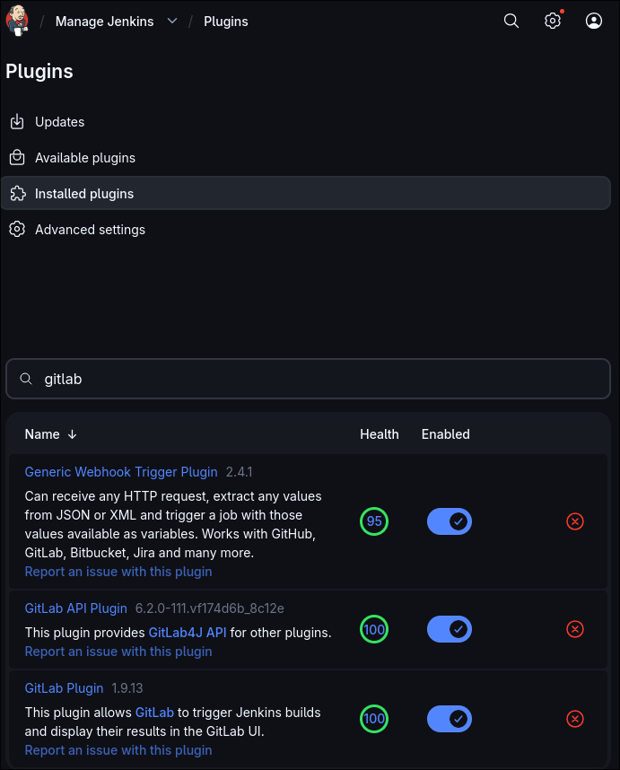
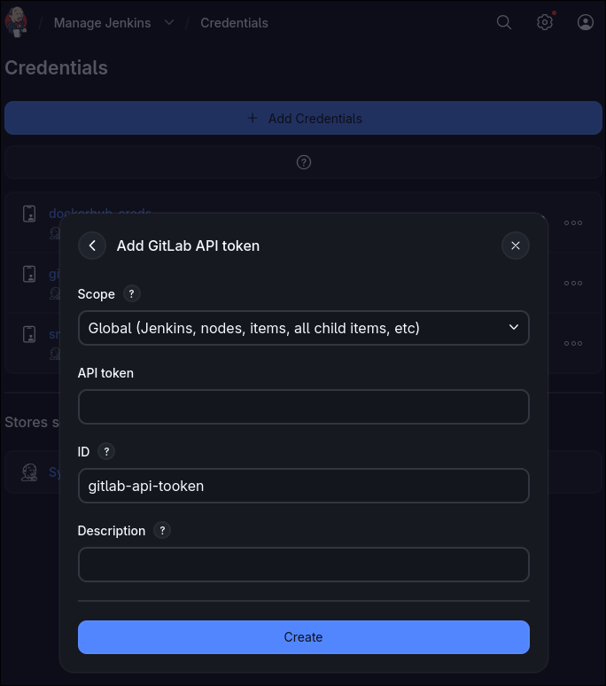
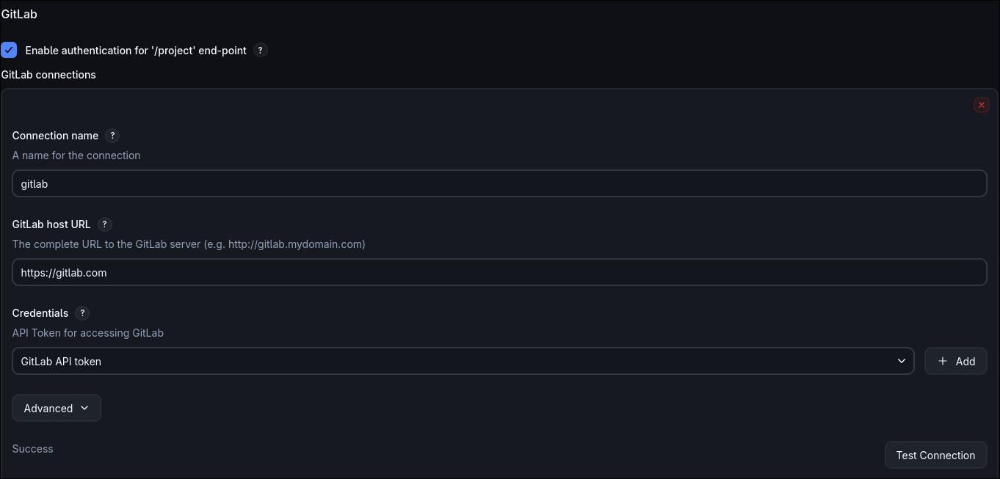
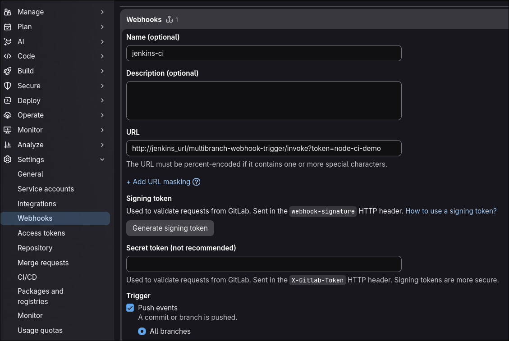

**What we're building:** A CI pipeline for a Node.js app on self-hosted Jenkins, triggered by GitLab pushes, with proper stages, credentials handling, and failure notifications

## Phase 1

### Repository & Node.js app scaffolding

_Before Jenkins can do anything, you need something worth testing. We'll create a minimal but realistic Node.js app one that has linting, unit tests, and a build step._

#### 1.1 create the GitLab repository

_Public repo, branch protection on main_

#### 1.2 Initialise the Node.js project

Clone the repo locally, then run:

```bash
# initialise — accept all defaults, then edit
npm init -y

# dev dependencies only — these never ship to production
npm install --save-dev eslint jest
```

Edit package.json and add the following scripts block. Jenkins will call these exact script names — never the tools directly:

```js
{
	"scripts": {
		"lint": "eslint src/",
			"test": "jest --coverage",
			"build": "echo 'build step placeholder'"
	}
}

```

_package.json, eslint, jest_

#### 1.3 write the application code and tests

_Create `src/math.js`_

```js
function add(a, b) {
	return a + b;
}

function divide(a, b) {
	if (b === 0) throw new Error("Division by zero");
	return a / b;
}

module.exports = { add, divide };
```

_Create `src/math.test.js`_

```js
const { add, divide } = require("./math");

test("adds two numbers", () => {
	expect(add(2, 3)).toBe(5);
});

test("divides correctly", () => {
	expect(divide(10, 2)).toBe(5);
});

test("throws on divide by zero", () => {
	expect(() => divide(1, 0)).toThrow("Division by zero");
});
```

Run `npm test`

## Phase 2

### Jenkins + GitLab integration

_Connect your self-hosted Jenkins to GitLab so that every push triggers a build. This covers the GitLab plugin, webhook setup, and credential management._

#### 2.1 Install the Gitlab plugin in Jenkins

_Manage Jenins -> Plugins_

- Gitlab APi Plugin
- Gitlab Plugin
- Git
- NodeJS plugin



#### 2.2 Create a GitLab access token

_Scoped to api_
Store it in JENKINS CREDENTIALS
Go to Manage Jenkins -> Credentials -> (global) -> Add credential:



#### 2.3 Configure the Gitlab connection in Jenkins

_Manage Jenkins -> System -> GitLab_
scroll to the **GitLab** section:

- Connection name: `gitlab`
- GitLab host URL: `https://gitlab.com` (or your self-hosted URL)
- Credentials: select `gitlab-api-token`

Click **Test Connection** — it must return "Success" before you proceed.



#### 2.4 Create a Multibranch Pipeline job

_New item -> Mutlibranch Pipeline_

#### 2.5 Configure the GitLab webhook

_Push events -> Jenkins triggers URL_
In your GitLab repo: **Settings → Webhooks → Add new webhook**:

- URL: `http://YOUR-JENKINS-HOST/multibranch-webhook-trigger/invoke?token=repo-name
- Trigger: Push events (check this)
- SSL verification: disable if Jenkins is on HTTP

**Jenkins must be reachable from GitLab.** If Jenkins is on a private LAN, GitLab.com can't reach it. Options: put Jenkins on a public IP, use a tunnel (ngrok for dev), or run a self-hosted GitLab on the same network.

After saving, click **Test → Push events**. You should see a green 200 OK response.



## Phase 3

### Writing your first Jenkins file

_Jenkinsfile lives in your repo it is your pipeline as code. We'll write a declarative Jenkinsfile with real stages._

- Declarative vs Scripted syntax
- Jenkinsfile skeleton
- Add the install dependenciew stage
- Add Lint and Test stages

## Phase 4

### Build artifact stage

_A CI pipeline should produce a versioned, deployable artifact. We'll archive build output in Jenkins and tag it with the commit SHA the foundation of traceability._

## Phase 5

### Pipeline hardening

_A pipeline that only works on green paths isn't production-ready. Add timeouts, failure notifications, and branch-specific behaviour._

- Add global timeout
- Add post-build notification
- Branch-specific behaviour (Only build artifacts on main)

SOURCE CODE:
https://gitlab.com/sudiplun/node-ci-demo
